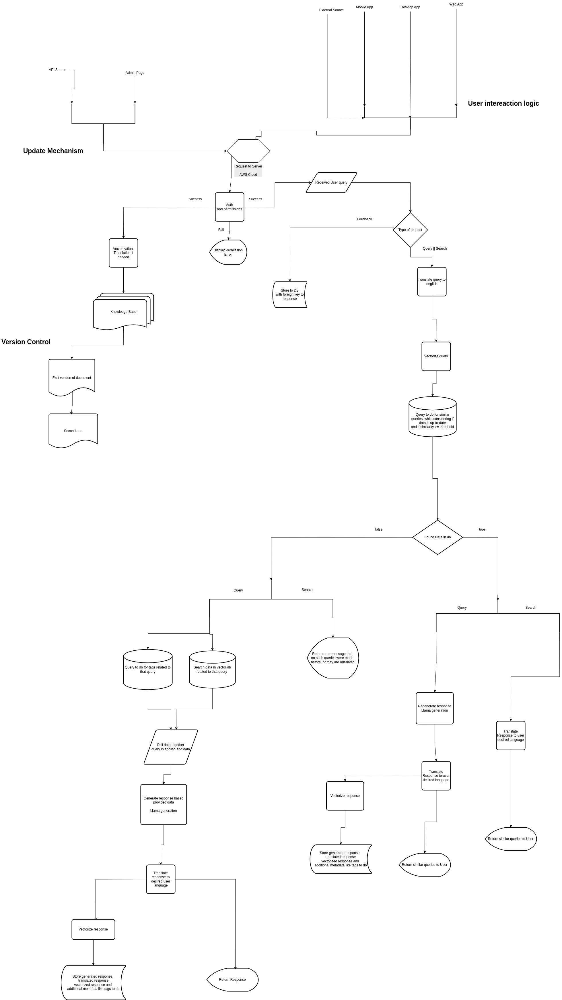

# 1. Introduction

## Functionality

* Responds to user queries related to government procedures and internal documentation

## Who helps

* new recruits
* civil servants

## Value

* Simplifies process of acquiring information
* Increased accuracy via information feed on response generation step
* Increased speed via optimised processes

# 2. System Architecture

## Modules

### Auth (SSO or basic)

Authorization part for access control

### Query Preprocessor (embedding + fallback)

* Translates query to English if necessary
* Embeds translated queries using SentenceTransformers
* If no relevant result is found in vector store (score < 0.75), query is routed to LLaMA for fallback generation

### Vector Store (Qdrant, FAISS)

* Stores and searches embeddings
* Filters responses by freshness (TTL of 30 days)

### Llama 3 Engine (AWS, via Langchain)

* Used for fallback query response generation
* Generates procedural instructions, rewrites, personalized answers
* Hosted on AWS Cloud infrastructure

### Translation Service

* **Inbound:** Translates queries to English
* **Outbound:** Translates responses back to Kazakh/Russian
* Uses confidence scores from translation model; if confidence is below threshold (e.g., 70%), asks user for clarification before proceeding

### Logging, Analytics, and Monitoring

* Logs every query, response, and feedback
* Analytics dashboard for weekly review
* Admin + Compliance Officer access to flagged items

### UI Clients (React, React Native)

App where user can interact with service and perform following actions:

1. Ask questions
2. Search for already asked ones
3. Give feedback

* Responsive design for both desktop and mobile platforms

### Knowledge base update mechanism
Knowledge is updated via admin page or API request, when documents have to be updated in different sources
Documents are automatically translated to English (if not already), preprocessed using chunking (e.g., 512-token sliding windows), and stored as embeddings in the vector database.

### Version control

App stores documents with version control as a feature, which is similar to github like, for simplifying cases when user wants to see updates

# 3. Llama 3 Integration

## Where and how Llama is used:

* Query rewriting and expansion (e.g., converting vague user intents into structured procedural queries)
* Generating clear procedural instructions
* Answer personalization
* Response generation fallback when no data found

## Model version LLaMA 3.3 70B

Model choice is based on quality need and not so high latency

# 4. Knowledge Base

* How documents are collected (e.g., Akimat DOCX, PDFs)
* How parsed (TextSplitter, OCR if needed)
* How embeddings are created (e.g., SentenceTransformers)
* How frequently re-indexed (e.g., weekly job)

# 5. Security & Compliance

* Local data storage (Postgres, S3, encrypted)
* Personal data anonymization
* Optional offline model for local install
* Role-based access for resources
  **Roles given:**

- User                ----------- Ask questions, see public procedures
- Editor              ----------- Manage documents, upload, update new regs
- Admin               ----------- Review flagged content, monitor feedback
- Compliance Officer  ----------- Monitors compliance, reviews sensitive or restricted document access, oversees flagged feedback logs

# 6. Feedback Loop

* Responses are rated (1-5) with optional comments
* Feedbacks are stored in separate table, linked by response ID
* Used for improving model prompts and optionally fine-tuning model outputs in future iterations
* Feedback dashboard to highlight:

  * Top poorly rated responses
  * Unanswered or repeated queries
  * Flagged responses for review

# 7. Pilot Implementation Plan

| Phase            | Timeline     | Key Deliverables                            |
|------------------|--------------|---------------------------------------------|
| Requirements     | Weeks 1–2    | Define document sources, access roles       |
| Development      | Weeks 3–6    | Backend services, vector DB, translation    |
| Integration      | Weeks 7–9    | Frontend UI, admin panel, feedback logging  |
| Testing & Review | Weeks 10–12  | Accuracy metrics, QA testing, fine-tuning   |

# 8. Stack & Infra

| Layer        | Tech                     |
| ------------ | ------------------------ |
| Frontend     | React / React Native     |
| Backend      | FastAPI                  |
| DB           | Postgres                 |
| Vector Store | Qdrant / FAISS           |
| LLM          | Llama 3 via AWS          |
| Hosting      | AWS EC2 / On-prem option |

# 9. Risks & Mitigation

| Risk                | Mitigation                                      |
| ------------------- | ------------------------------------------------|
| Llama 3 latency     | Cache common queries, pre-generation            |
| Poor search result  | Manual override or rule-based fallback          |
| Feedback ignored    | Weekly feedback analytics dashboard             |
| Language errors     | Prompt optimization, Kazakh QA                  |
| Integration blocked | Use adapter layer for DMS sync                  |
| Outdated document cache | Weekly refresh job + manual override option |

# 10. Architecture Flow (Visual Description)

1. Query received (Mobile, Web, Desktop)
2. Translated to English
3. Embedded & searched in vector DB
4. If match & fresh => return translated response
5. If not => Llama 3 generates response
6. Response is translated back to user language, vectorized, and stored in DB as part of searchable history
7. User receives response, can rate it
8. Feedback logged and reviewed in analytics dashboard

# 11. Compliance Deep-Dive

* Encrypted S3 and Postgres for all sensitive data
* Optional air-gapped offline deployments supported
* Only Admin/Compliance Officers access feedback and flagging logs

# 12. Summary

This solution fully meets the Astana Digital Mentor challenge:

* Covers civil servant use-cases with multilingual support
* Has reliable fallback, quality control, and compliance monitoring
* Designed for scalable deployment across devices and departments

# 13. Q&A

* Q: Why use translation to English?
* A: Llama model is trained mainly on English sentences. Thus, quality of responses is lower when queried in Russian or Kazakh. Translating to English ensures better understanding and generation quality.

* Q: What models are used for translation?
* A: We use pre-trained multilingual models (e.g., NLLB-200 or MarianMT) for inbound and outbound translation, ensuring both high-quality and fast response times.

